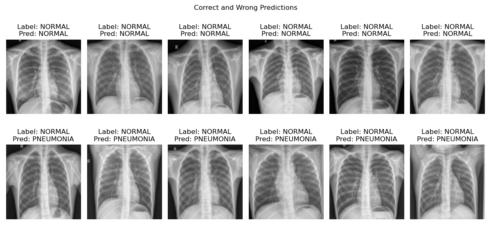
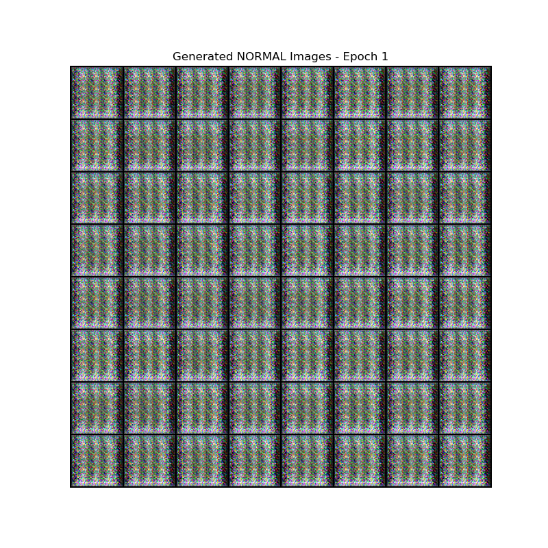

# Chest X-Ray Pneumonia Detection and Image Generation

Girish Krishnan | [LinkedIn](https://www.linkedin.com/in/girk/) | [GitHub](https://github.com/Girish-Krishnan)
___


This repository contains several deep learning models and scripts for detecting pneumonia in chest X-ray images and generating synthetic images. The project includes implementations for:

- **Image classification using Inception-v3 and VGG19** to classify chest X-ray images as NORMAL or PNEUMONIA.
- **Generative models including GAN, Conditional GAN, and Variational Autoencoder (VAE)** to generate synthetic chest X-ray images.

The dataset used is the [Chest X-Ray Pneumonia Dataset](https://www.kaggle.com/datasets/paultimothymooney/chest-xray-pneumonia). Follow the instructions below to set up and run the project.

## Features
- **Classifier Models:**
  - `classifier_inception.py`: Classifies images using the Inception-v3 architecture.
  - `classifier_vgg19.py`: Classifies images using the VGG19 architecture.
- **Generative Models:**
  - `gan.py`: Generates synthetic chest X-ray images using a standard GAN.
  - `conditional_gan.py`: Generates synthetic images conditioned on labels (NORMAL or PNEUMONIA).
  - `vae.py`: Reconstructs images and generates synthetic images using a Variational Autoencoder.

## Setup
### Prerequisites
- Python 3.8+
- PyTorch 1.12+
- Required Python libraries:
  ```bash
  pip install torch torchvision matplotlib scikit-learn tqdm
  ```

### Dataset
1. Download the dataset from [Kaggle](https://www.kaggle.com/datasets/paultimothymooney/chest-xray-pneumonia).
2. Extract the dataset and place it in the `./chest_xray` directory. The folder structure should look like this:
   ```
   ./chest_xray
   ├── train
   ├── val
   └── test
   ```

**Note**: if you download the dataset as a `.zip` file from Kaggle, you might get a weird folder structure, where the `chest_xray` folder contains another subfolder called `chest_xray`, which contains a duplicate of the dataset.

## Usage

### 1. Classifiers
#### Inception-v3
To train and evaluate the Inception-v3 model, run the following command:
```bash
python classifier_inception.py
```
Results include:
- Training and validation loss/accuracy curves.
- Correct and incorrect predictions from the test set.

Here are example plots obtained from running the script. I recommend tuning the hyperparameters and training for more epochs to improve the model performance.


#### VGG19
To train and evaluate the VGG19 model, run the following command:
```bash
python classifier_vgg19.py
```
Results include:
- Training and validation loss/accuracy curves.
- Correct and incorrect predictions from the test set.

Once again, I recommend tuning the hyperparameters and training for more epochs to improve the model performance.




### 2. GANs
#### Standard (Unconditional) GAN


To train and generate images using a standard GAN:
```bash
python gan.py
```
The generated images are saved in `./generated_images` after each epoch. Note that this script does not condition the generated images on any label, and the generated images could be of either class.

Once you get the images generated, you can use the `generate_gif.py` script inside the `./generated_images` directory to create a gif animation of the generated images.

Here is an example gif showing the generated images after each epoch:


#### Conditional GAN


To train and generate images using a conditional GAN:
```bash
python conditional_gan.py
```
Conditioned images for NORMAL and PNEUMONIA are saved in `./conditional_generated_images`.


Here are example generated images for the NORMAL and PNEUMONIA classes, at different epochs:

##### NORMAL

|||
|:---:|:---:|
|||
|||

##### PNEUMONIA

|||
|:---:|:---:|
|||
|||


### 3. Variational Autoencoder (VAE)


To train the VAE and generate synthetic images:
```bash
python vae.py
```
Results include:
- Loss curves.
- Reconstructions of test images.
- Generated synthetic images for NORMAL and PNEUMONIA classes.

#### Example VAE Results

These are just example results from a training run. I recommend tuning the hyperparameters and training for more epochs to improve the model performance.

- **Loss Curve:**
  

- **Reconstructions:**
These are the original images (top row) and their corresponding reconstructions (bottom row).
  

- **Generated Images:**
  

## Acknowledgments
- The dataset is provided by [Kaggle](https://www.kaggle.com/).
- Pretrained models used in this project are available through the [torchvision library](https://pytorch.org/vision/).

## License
This project is licensed under the MIT License. See the `LICENSE` file for details.